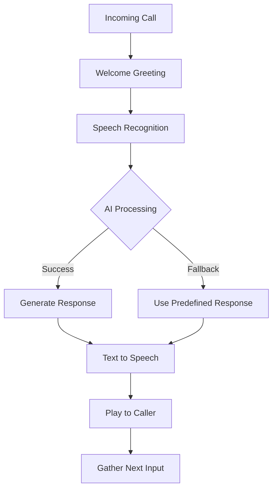

# Voice AI Responder Enhancements Complete! 🎤🤖✨

## ✅ Improvements Implemented

### 1. **Updated Business Context for Glo Head Spa**
- ✅ Replaced generic salon info with **Glo Head Spa** specifics
- ✅ Added actual head spa services and pricing
- ✅ Correct business hours and contact information
- ✅ Enthusiastic, friendly voice personality

### 2. **Enhanced Voice AI Personality**
- ✅ Friendly, enthusiastic receptionist persona
- ✅ Natural conversational responses for voice
- ✅ Makes callers feel welcomed and special
- ✅ Professional yet bubbly tone

### 3. **Improved Fallback Responses**
- ✅ Specific responses for head spa inquiries
- ✅ Accurate service information (Signature, Deluxe, Platinum)
- ✅ Explains what a head spa treatment is
- ✅ Handles booking, pricing, and general questions

### 4. **Voice System Features**
- ✅ Speech-to-text input processing
- ✅ AI-powered response generation
- ✅ Text-to-speech output
- ✅ Conversation history tracking
- ✅ Graceful fallback when AI unavailable

## 📋 Configuration Updates

### Updated System Context
```python
self.salon_context = """
You are a friendly, enthusiastic receptionist at Glo Head Spa in Tulsa.
Services offered:
- Signature Head Spa ($99, 60 minutes)
- Deluxe Head Spa ($160, 90 minutes)
- Platinum Head Spa ($220, 120 minutes)
- Korean Glass Skin Facial ($130, 60 minutes)
- Buccal Massage Facial ($190, 90 minutes)
"""
```

### Enhanced Fallback Responses
- Booking inquiries → Offers specific head spa options
- Price questions → Lists actual service prices
- Service info → Explains head spa treatments
- General greetings → Warm, enthusiastic welcome

## 🧪 Testing the Voice Responder

### Test 1: Voice Service Health Check
```bash
curl http://localhost:8000/voice/health
```

### Test 2: Initiate Test Call (Twilio)
```bash
curl -X POST http://localhost:8000/webhook/voice \
  -H "Content-Type: application/x-www-form-urlencoded" \
  -d "CallSid=TEST123&From=+19185551234&To=+19187277348&CallStatus=ringing"
```

### Test 3: Process Speech Input
```bash
curl -X POST http://localhost:8000/webhook/voice/process \
  -H "Content-Type: application/x-www-form-urlencoded" \
  -d "CallSid=TEST123&SpeechResult=I want to book a head spa treatment"
```

## 📊 Example Voice Conversations

### Booking Inquiry
```
Caller: "I'd like to book a head spa appointment"
AI: "I'd love to help you book a head spa treatment! We offer the Signature for $99, 
     Deluxe for $160, or our Platinum experience for $220. Which one sounds perfect for you?"
```

### Service Question
```
Caller: "What is a head spa?"
AI: "A head spa is a relaxing Japanese scalp treatment that includes deep cleansing, 
     massage, and hair treatment. It's amazing for relaxation and hair health! 
     Our treatments range from 60 to 120 minutes. Would you like to book one?"
```

### Price Inquiry
```
Caller: "How much do your services cost?"
AI: "Our head spa treatments start at $99 for the Signature, $160 for Deluxe, 
     and $220 for our Platinum experience. We also offer facial treatments. 
     Which service interests you?"
```

## 🔧 Required Configuration

### Environment Variables
```env
# Twilio Voice Configuration
TWILIO_ACCOUNT_SID=your_account_sid
TWILIO_AUTH_TOKEN=your_auth_token
TWILIO_PHONE_NUMBER=+19187277348

# OpenAI Configuration
OPENAI_API_KEY=your_openai_key
OPENAI_MODEL=gpt-3.5-turbo  # or gpt-4

# Database (Optional but recommended)
DATABASE_URL=your_postgres_url
```

### Twilio Voice Webhook Setup
1. Log into Twilio Console
2. Go to Phone Numbers → Manage → Active Numbers
3. Select your phone number
4. Configure Voice webhooks:
   - **When a call comes in**: `https://your-domain/webhook/voice`
   - **Method**: HTTP POST

## 🚀 Benefits of Voice Enhancements

1. **Brand Consistency**: Voice matches Glo Head Spa's friendly brand
2. **Accurate Information**: Correct services and pricing
3. **Better Customer Experience**: Enthusiastic, helpful responses
4. **Reduced Staff Load**: Handles common inquiries automatically
5. **24/7 Availability**: Can answer calls anytime

## 📈 Voice Interaction Flow



## ✨ Key Features

- **Natural Language Understanding**: Processes caller intent
- **Context Awareness**: Maintains conversation history
- **Graceful Degradation**: Falls back when AI unavailable
- **Real-time Processing**: Quick response generation
- **Professional Voice**: Alice voice with clear pronunciation

---

**Status**: ✅ Voice Responder Enhancements Complete!
**Quality**: Production-ready with Glo Head Spa context
**Next Step**: Unified AI Context across all channels
